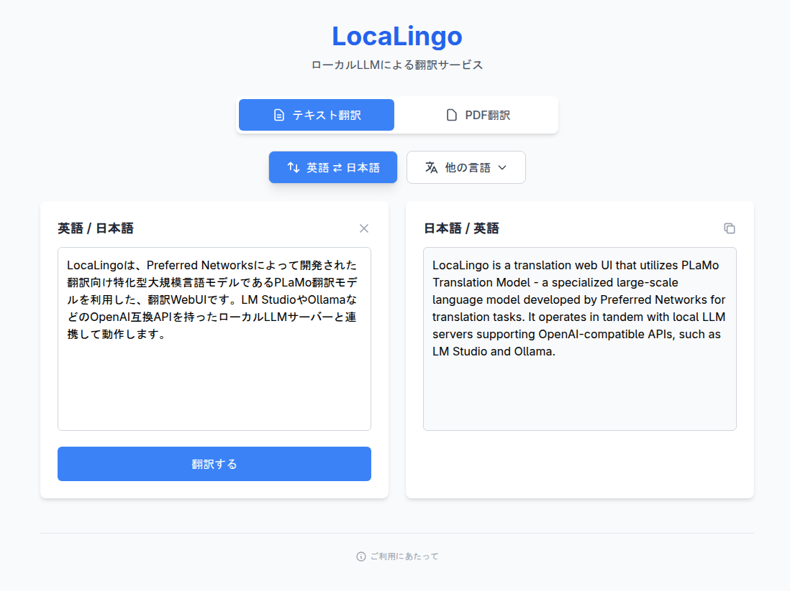

# LocaLingo

LocaLingoは、Preferred Networksによって開発された翻訳向け特化型大規模言語モデルであるPLaMo翻訳モデルを利用した、翻訳WebUIです。LM StudioやOllamaなどのOpenAI互換APIを持ったローカルLLMサーバーと連携して動作します。



テキストの翻訳だけでなく、PDFファイルの翻訳にも対応しています。PDFMathTranslateというライブラリを利用し、フォーマットを維持したまま翻訳を行います。PDF中に画像や図表が含まれていても問題ありません。(ただし、画像中の文字は翻訳されません。)


## 特徴

- **文字長制限なし**: 一般の翻訳ツールでは2000文字程度の制限がありますが、LocaLingoではそのような制限はありません。使用するLLMサーバーの制限に依存しますが、数万、数十万文字の翻訳も可能です。
- **ローカルでの動作**: インターネット接続が不要で、データのプライバシーを保護できます。すべての翻訳処理はローカル環境で行われます。
- **使いやすいUI**: 直感的なユーザーインターフェースを提供し、簡単に翻訳作業を行えます。
- **複数言語対応**: 英語、日本語、中国語、韓国語、フランス語、ドイツ語、スペイン語など、多数の言語間での翻訳が可能です。
- **PDF翻訳対応**: PDFファイルの翻訳が可能です。フォーマットを維持したまま翻訳を行います。

## 動作させる手順

### LLMサーバーの用意

1. LM StudioやOllamaなど、OpenAI互換APIを持ったローカルLLMサーバーをインストールし、起動します。
2. [pfnet/plamo-2-translate · Hugging Face](https://huggingface.co/pfnet/plamo-2-translate)や[mmnga/plamo-2-translate-gguf · Hugging Face](https://huggingface.co/mmnga/plamo-2-translate-gguf)などを参考に、PLaMo翻訳モデルをLLMサーバーにロードします。
3. LLMサーバーがOpenAI互換APIで動作していることを確認します。
   - 例えばLM Studioの場合、Serve on Local Networkのオプションを有効にする必要があります。

以下のようなcurlコマンドを実行して、LLMサーバーが正しく動作していることを確認します。ポート番号やエンドポイントは、使用しているLLMサーバーに応じて適宜変更してください。

```bash
curl http://localhost:1234/v1/chat/completions \
  -H "Content-Type: application/json" \
  -d '{
    "model": "plamo-2-translate",
    "messages": [
      {
        "role": "user",
        "content": "<|plamo:op|>dataset\ntranslation\n\n<|plamo:op|>input lang=English\nHello!\n<|plamo:op|>output lang=Japanese"
      }
    ]
  }'
```

PLaMo翻訳モデルは長文翻訳に対応していますが、ほとんどの場合LLMサーバーの設定で出力トークン長が制限されています。出力トークン長の設定を適切に調整してください。

### ローカルでのみ動作させる場合

1. compose.ymlを開き、tunnelに関するセクションをコメントアウトあるいは削除します。また、`LLM_ENDPOINT`環境変数を、使用しているLLMサーバーのエンドポイントに設定します。
2. 以下のコマンドを実行して、LocaLingoを起動します。

```bash
sudo docker-compose up -d
```

### Cloudflare Tunnelを用いて外部公開する場合

Cloudflareのサービスについての詳細な説明は他のドキュメントを参照してください。

1. compose.ymlを開き、`LLM_ENDPOINT`環境変数を使用しているLLMサーバーのエンドポイントに設定します。
2. `.env`ファイルを作成し、Cloudflare Tunnelの認証トークンを`TUNNEL_TOKEN`環境変数に設定します。
3. 必要に応じてCloudflare Accessの設定を行って下さい。この設定を行わない場合、全世界の誰でも翻訳サービスにアクセスできるようになります。
4. 以下のコマンドを実行して、LocaLingoを起動します。

```bash
sudo docker-compose up -d
```

## 注意事項

1. LocaLingoは、Preferred Networksが開発したPLaMo翻訳モデルを利用しています。PLaMo翻訳モデルの使用には、PLaMoコミュニティライセンスに従う必要があります。具体的には、個人や中小規模の企業は有償無償問わず自由に使用できますが、大規模な商用利用には別途ライセンス契約が必要です。詳細は[PLaMo Community Licenseについて](https://tech.preferred.jp/ja/blog/plamo-community-license/)や[PLaMoコミュニティライセンス契約](https://plamo.preferredai.jp/info/plamo-community-license-ja)をご参照ください。
2. LocaLingoはLLMサーバーの機能を持っていません。動作させるためには、LM StudioやOllamaなどのOpenAI互換APIを持ったローカルLLMサーバーが必要です。
3. 初期状態ではすべての翻訳を記録します。翻訳データを保存しないようにするには、compose.yml内の`SAVE_TRANSLATIONS`環境変数を`false`に設定してください。
